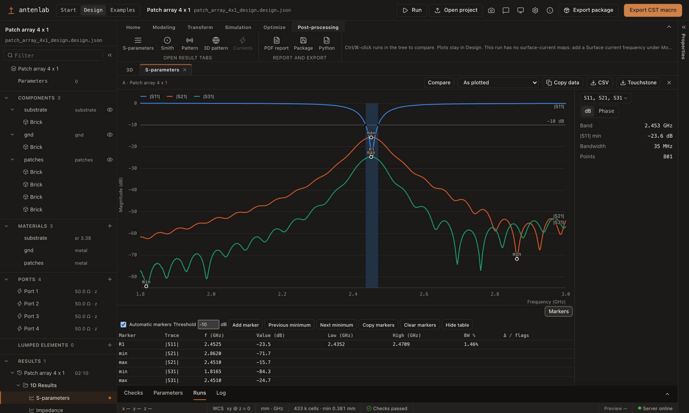

# Fairbeam

**The open electromagnetic workbench.** Design, simulate and document antennas and RF circuits on
the open-source [openEMS](https://openems.de) FDTD solver, from a ribbon-based 3D designer or from
parametric Python models.

[Website](https://fairbeam.org) · [Download](https://github.com/ismailakdag/fairbeam-releases/releases/latest) ·
[Browser demo](https://fairbeam.org/app/) · [Getting started](docs/GETTING-STARTED.md) ·
[Documentation](docs/README.md)



## Download

The desktop app is free, for **macOS** (Apple silicon, signed and notarized) and **Windows** x64.
Get the latest version from
[fairbeam-releases](https://github.com/ismailakdag/fairbeam-releases/releases/latest). The app
installs its own runtime (Python and openEMS) for your user on first start and updates itself.
[Getting started](docs/GETTING-STARTED.md) takes you from installing to reading the results of a
patch antenna in five minutes.

The Windows installer is not code-signed. On the first run SmartScreen shows "Windows protected
your PC": choose **More info › Run anyway**. The macOS app is signed and notarized. The
[browser demo](https://fairbeam.org/app/) opens the example projects read-only, without installing
anything.

## What it does

- **Designer.** Draw parametric solids and sheets, use Boolean operations, transforms and a working
  coordinate system, add ports and lumped elements, check the model, mesh it and run it, in one
  window ([designer guide](docs/DESIGNER.md)).
- **Simulation.** openEMS on the CPU, or the optional GPU engine (Metal on Apple silicon, CUDA on
  NVIDIA cards). Automatic meshing, mesh convergence, parameter sweeps and a goal-driven optimizer
  ([meshing](docs/MESHING.md), [run server](docs/RUN-SERVER.md), [optimizer](docs/OPTIMIZE.md),
  [GPU engine](docs/GPU.md)).
- **Results.** S-parameters with markers, impedance, VSWR, Smith and polar charts, 2D and 3D
  far-field patterns (directivity, gain, realized gain, efficiency), surface currents and field
  planes, multi-port S-matrices and arrays with beam steering. Every chart has a table, and runs
  can be compared ([results](docs/RESULTS.md), [multi-port](docs/MULTIPORT.md),
  [arrays](docs/ARRAYS.md)).
- **Python models and CLI.** One Python file per antenna or circuit, with templates; the `fairbeam`
  CLI runs, sweeps, converges and optimizes them ([writing models](docs/MODELS.md),
  [CLI](docs/CLI.md)).
- **Outputs.** B&W technical drawings, publication figures, a PDF report and an export package;
  Touchstone and CSV; STL, glTF and Blender scenes, with optional rendered images; fabrication files
  (Gerber X2, Excellon, DXF; preview) ([exports](docs/EXPORTS.md)).
- **File compatibility.** CST-compatible VBA macro export (`.bas`) and macro import (`.bas`,
  `.mcs`, `.txt`) ([designer guide](docs/DESIGNER.md#importing-a-vba-macro)).

## Open and reproducible

Fairbeam follows the FAIR principles:
- **Findable** results: versioned, self-describing project bundles that record the generator, the
  versions and the run settings (`fairbeam.project/1`).
- **Accessible:** open formats and no licence server.
- **Interoperable:** Touchstone, CSV, STL, glTF, Gerber/Excellon and VBA macros.
- **Reusable:** GPL-3.0 parametric models with their recorded inputs.

Results are checked against analytical references ([validation](docs/VALIDATION.md),
[how results are computed](docs/RESULTS.md)).

## Status

Fairbeam 0.7 is a development release. The Python pipeline, the designer and the desktop app work
end to end on macOS (Apple silicon) and on Windows 11. The project file format is versioned, and
breaking changes bump its version. The fabrication outputs
have not yet been checked by a fab. Known gaps and plans are in
[the roadmap](docs/ARCHITECTURE.md#roadmap).

## From source

Requirements: Python 3.10+, Node.js 20+ and an openEMS build. On macOS (and Linux) a script builds
openEMS for you:

```bash
scripts/install-openems-macos.sh                              # openEMS + CSXCAD into ~/opt/openEMS (5-10 min)
~/opt/openEMS/venv/bin/fairbeam run python/models/patch_antenna.py
npm install
npm run serve &   # the run server on port 5320 (Run panel, sweeps, optimizer)
npm run dev       # the viewer and designer on http://127.0.0.1:5310
```

- Windows: [docs/WINDOWS.md](docs/WINDOWS.md).
- The desktop app: [docs/DESKTOP.md](docs/DESKTOP.md).
- Everything else, including the test suite: [docs/FROM-SOURCE.md](docs/FROM-SOURCE.md).

## Contributing and feedback

- Found a problem or missing something? Use **Help › Report a problem** in the app, or open an
  issue at [fairbeam-releases](https://github.com/ismailakdag/fairbeam-releases/issues). The app
  fills in the version and the operating system.
- Code and documentation contributions are welcome as pull requests here. Read
  [CONTRIBUTING.md](CONTRIBUTING.md) first.
- Fairbeam is developed with AI coding assistance. How that works, and the rules for AI-assisted
  contributions, are in the [AI policy](AI_POLICY.md).

## Credits

- **Maintainer:** [İsmail Akdağ](https://akdag.dev).
- **Contributors:** [Cem Göçen](https://github.com/cgroceny):
  - the material cell (NRW/NIST extraction);
  - dispersive materials (Debye, Lorentz, Drude, Djordjevic-Sarkar);
  - waveguide, coaxial, stripline and surface-wave reference fixtures;
  - two-line calibration, ideal network and L/C references;
  - grouped discrete ports and multiport convergence criteria.
- **Solvers:** Fairbeam runs [openEMS](https://openems.de) and [CSXCAD](https://github.com/thliebig/CSXCAD)
  by Thorsten Liebig and contributors. The optional GPU engine is
  [SeanMollet/openEMS](https://github.com/SeanMollet/openEMS).
- **Libraries:** the viewer uses [SolidJS](https://www.solidjs.com) and
  [three.js](https://threejs.org), and the desktop shell is built with [Tauri](https://tauri.app).
- **Details:** every bundled component, with its licence and source, is listed in [NOTICE.md](NOTICE.md).

## License

Fairbeam is free software under the GNU General Public License, version 3 or later
([LICENSE](LICENSE)). openEMS is GPL-3.0-or-later; CSXCAD and fparser are LGPL-3.0-or-later. Project
bundles are plain data produced by your own models. Third-party notices are in
[NOTICE.md](NOTICE.md).
