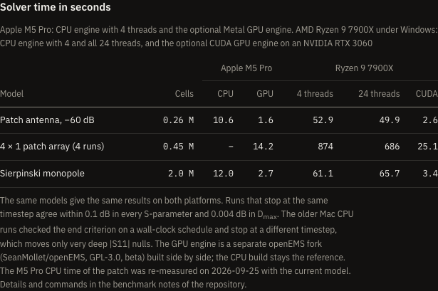
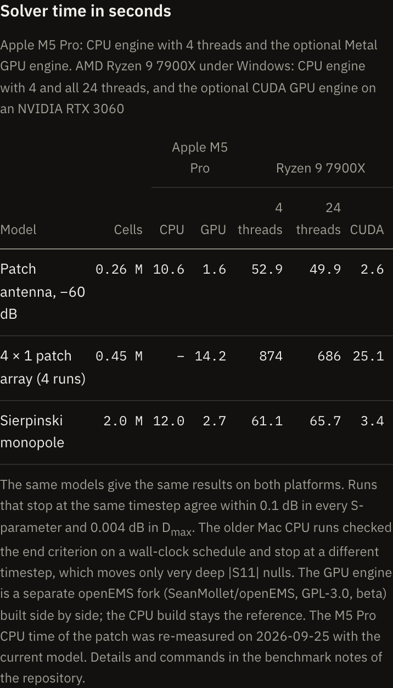
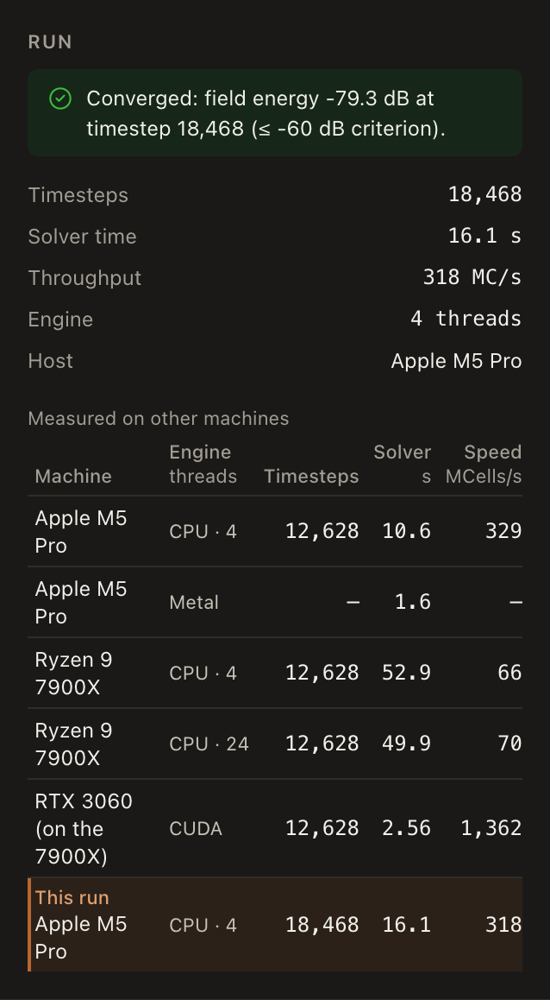

# Benchmarks: the 14 examples on a Ryzen 9 7900X (Windows) and an Apple M5 Pro (macOS)

The reference bundles in `public/projects/` were computed on an Apple M5 Pro: some models on the
CPU engine with 4 threads, the others on the Metal GPU engine ([GPU.md](GPU.md)). This page adds a
Windows desktop and compares both the results and the solver times.

## Host

| | |
|---|---|
| CPU | AMD Ryzen 9 7900X, 12 cores / 24 threads |
| RAM | 32 GB DDR5-7200 (2 × 16 GB, dual channel) |
| GPU | NVIDIA GeForce RTX 3060, 12 GB (used only by the CUDA runs below) |
| OS | Windows 11 Pro 25H2, build 26200 |
| openEMS | v0.37.0-rc3, official MSVC build (CPU engine "compressed SSE + multi-threading") |
| Python | 3.13.15, repository venv (`docs/WINDOWS.md`) |

Normal desktop programs (browser, chat clients) were open; the idle load was 5 to 11 %.

## Commands

Every model with its default parameters, as the committed bundles were made; the Sierpinski
monopole twice (`--set iterations=0` / `3`). Each run once with 4 threads and once with all cores.
Nothing is written into `public/projects/`:

```powershell
$B = ".sim\bench"   # in the repository root (ignored by git)
python -m fairbeam run python\models\patch_antenna.py --threads 4 --quiet --out "$B\t4"  --sim-root "$B\sim"
python -m fairbeam run python\models\patch_antenna.py --threads 0 --quiet --out "$B\all" --sim-root "$B\sim"
# ... every model in python\models; the Sierpinski monopole with --set iterations=0 and --set iterations=3

python scripts\bench_compare.py --run "t4=$B\t4" --run "all=$B\all" --json docs\benchmarks\windows-7900x.json --markdown
```

The raw numbers are in [benchmarks/windows-7900x.json](benchmarks/windows-7900x.json).

## Results

Solver times are the sum over all port runs. The M5 Pro columns are the committed bundles: `cpu/4`
is the CPU engine with 4 threads, `gpu` the Metal engine. Δ is Windows (4 threads) minus M5 Pro.

| Model | Cells | Timesteps M5 Pro → Windows | Windows 4 threads | Windows 24 threads | M5 Pro | M5 Pro engine | Δ\|S11\| min | ΔDmax | Δ efficiency | max Δ\|Sij\| (above −30 dB) |
|---|---:|---|---:|---:|---:|---|---:|---:|---:|---:|
| Dipole | 194,940 | 10842 → 8505 | 49.2 s | 46.7 s | 16.1 s | cpu/4 | +4.40 dB | +0.004 dB | +0.001 | – |
| Inset-fed patch | 173,932 | 9440 → 6966 | 45.7 s | 54.3 s | 12.1 s | cpu/4 | −0.34 dB | +0.001 dB | −0.007 | – |
| Minkowski patch | 123,008 | 29073 → 26334 | 111.9 s | 99.0 s | 16.1 s | cpu/4 | +0.51 dB | 0.000 dB | −0.003 | – |
| Patch antenna | 276,138 | 18468 → 12628 | 46.6 s | 49.9 s | 16.1 s | cpu/4 | −1.48 dB | −0.001 dB | −0.016 | – |
| Sierpinski, iteration 0 | 1,879,416 | 3380 → 3960 | 48.4 s | 61.3 s | 8.0 s | cpu/4 | −0.01 dB | −0.007 dB | −0.001 | – |
| Sierpinski, iteration 3 | 2,012,304 | 4930 → 5250 | 61.1 s | 65.7 s | 12.0 s | cpu/4 | 0.00 dB | ≤ 0.007 dB | ≤ 0.001 | – |
| Axial-mode helix | 1,391,208 | 17200 → 17270 | 489.4 s | 336.4 s | 10.3 s | gpu | −1.09 dB | 0.000 dB | 0.000 | – |
| Pyramidal horn | 1,136,520 | 10800 → 10320 | 224.6 s | 153.3 s | 5.6 s | gpu | −0.26 dB | ≤ 0.005 dB | ≤ 0.002 | – |
| Microstrip line | 53,792 | 7040 (same) | 10.7 s | 4.9 s | 0.85 s | gpu | 0.00 dB | – | – | 0.003 dB |
| Patch array 2 × 1 | 52,947 | 15225 (same) | 106.0 s | 84.9 s | 2.1 s | gpu | 0.00 dB | 0.000 dB | 0.000 | 0.002 dB |
| Patch array 4 × 1 | 452,270 | same, 4 runs | 873.8 s | 686.4 s | 14.2 s | gpu | −0.09 dB | ≤ 0.004 dB | 0.000 | 0.093 dB |
| Wilkinson divider | 113,103 | same, 3 runs | 41.1 s | 25.7 s | 2.1 s | gpu | 0.00 dB | – | – | 0.001 dB |
| Branch-line coupler | 81,432 | 8883 (same), 4 runs | 49.0 s | 20.8 s | 2.4 s | gpu | 0.00 dB | – | – | see below |
| Stepped low-pass | 133,977 | 23744 (same), 2 runs | 55.2 s | 42.6 s | 4.1 s | gpu | 0.00 dB | – | – | see below |

Patch antenna, 4 threads, three runs: 46.6, 52.9 and 58.0 s, **median 52.9 s** (±11 %, with the
desktop in use).

**The same patch antenna on the M5 Pro, re-measured on 2026-09-25** with the current model and the
same command (CPU engine, 4 threads, into a scratch folder): 12628 timesteps, the same stop as on
Windows, and a solver time of **10.6 s** (best of two runs: 10.59 and 10.75 s; wall time 11.5 s;
329 MCells/s). At the same timestep the 7900X with 4 threads takes 5.0 times as long (52.9 s). The
committed bundle's 16.1 s above is the older run that stopped at 18468 timesteps.

"Cells" in these tables is the product of the mesh lines per axis (`run.grid`), as the bundles store
it; the website counts cells between lines (patch antenna: 68 × 68 × 57 = 0.26 M).

### What the comparison shows

- **Same stopping timestep, same results.** Where both platforms stopped at the same timestep
  (microstrip line, both patch arrays, Wilkinson divider), Windows' CPU engine and the M5 Pro's
  Metal GPU engine agree to within 0.1 dB in every S-parameter above −30 dB, and to within
  0.004 dB in Dmax.
- **Different stopping timestep for the older M5 Pro CPU bundles.** They were made before Fairbeam
  checked the end criterion on a fixed timestep schedule (`exact_endcriteria`); openEMS then
  checked it every ~4 s of wall time, so the run stopped wherever the next check fell. The dipole,
  for example, ran 10842 timesteps (checks at 2808, 5538, 8268, 10842) where Windows stops at 8505,
  the first Nyquist-period check below −60 dB. Dmax still agrees to within 0.007 dB and the
  efficiency to within 0.016; only very deep |S11| nulls move by up to 4.4 dB.
- **Branch-line coupler and stepped low-pass:** the bundles the Windows run was compared with
  were older than the model code's mesh (the split-gap grading fix of the mesher,
  [MESHING.md](MESHING.md)), so the grids differed. Both were re-run on the M5 Pro's Metal engine
  on 2026-09-25 and re-committed; their rows above compare the new bundles with the numbers in
  `windows-7900x.json` (the Windows bundles themselves were not kept). Grid, stopping timestep and
  |S11| minimum now agree exactly (branch-line −34.845 dB at 2.4137 GHz, low-pass −48.0 dB at
  2.027 GHz, both platforms). The JSON has no full S-matrix, so max Δ|Sij| cannot be given for
  these two.
- **Speed.** Per cell and timestep, the M5 Pro's CPU engine with 4 threads is 4 to 8 times as fast
  as this Windows build with 4 threads (patch antenna 318 against 75 MCells/s).
- **Threads.** More threads help the Windows build only for some models: from 4 to 24 threads, the
  multi-port models, the helix and the horn take 20 to 58 % less time, while the single-port
  antennas stay the same or get slower (Sierpinski, iteration 0: 48 → 61 s). Four threads is a
  good default on this machine.

### Threads: what "Auto" does

Settings, the Run dialog and the Run panel offer **Auto** (the default for new installs). The
server (`python/fairbeam/resources.py`, `auto_threads`) picks the count from the host and the grid:

- it counts **physical cores**, not hyperthreads (the FDTD kernel is memory-bound: on the 7900X
  24 threads gave 0.6 to 2.4 times the speed of 4, and were slower for the single-port antennas);
- with 4 or more physical cores it keeps one free for the app, with 1 or 2 it uses 1, with 3 it uses 3;
- it caps the count by grid size: under 0.5 M cells (or unknown) 4 threads, under 2 M cells 8, above
  that 12 (the largest example grids are about 2 M cells);
- CPUs are those the process may use (CPU affinity is honoured; the logical count is the fallback),
  and a manual choice is clamped to them.

Results: 8 or more logical CPUs with 4+ physical cores give 3 to 4 threads on small grids, a
12-core/24-thread PC 4 (up to 11 above 2 M cells). A manual number always wins over Auto; "Auto" is a
resource choice, not a temperature guarantee.
**Migration:** a stored Settings value of exactly 4 (the old default, indistinguishable from a
deliberate 4) is turned into Auto once; every other number is kept. A single CLI run now defaults to
the same host-and-mesh Auto policy. An explicit `--threads 0` passes openEMS' native tuner, which
starts at one thread and adjusts at progress intervals; it does not mean all cores. Sweep, converge
and optimize keep their default of 4.

### Pre-run estimate and preflight

The time estimate uses, in this order: the median MCells/s of this computer's own earlier runs
(`speed_mcells_s` and `host_cpu` in `index.json`, same engine), else the median of the benchmark
table's rows for a computer of the same CPU name, else the fixed 250 (CPU) / 700 (GPU) MCells/s,
lowered for small grids. The dialog says which one it used.
Before a run the server (`POST /api/preflight`, also enforced by `POST /api/runs` when it gets the
mesh size as `cells`) estimates about 90 bytes per cell and compares it with the free memory: it
warns above 60 % and refuses above 90 %, with a message, and warns when another run already uses the
CPU or the machine's load is high. CUDA GPU memory is not read (shown as unknown, never as safe); on
Metal, unified memory is checked once. Nothing is coarsened or relaxed automatically.

## CUDA GPU engine on the same machine

GPU: NVIDIA GeForce RTX 3060, 12 GB, compute capability 8.6, driver 591.74. Engine: the openEMS
fork's Windows CUDA package `v0.37.0-beta1+gpu`, installed with
`scripts\install-openems-gpu-windows.ps1` ([GPU.md](GPU.md)).

```powershell
$env:OPENEMS_INSTALL_PATH = "C:\opt\openEMS-gpu"
C:\opt\openEMS-gpu\venv\Scripts\python.exe -m fairbeam run python\models\patch_antenna.py --engine gpu --out "$B\gpu" --sim-root "$B\sim"
python scripts\bench_compare.py --run "cuda=$B\gpu" --ref "$B\t4" --json docs\benchmarks\windows-7900x-rtx3060-cuda.json
```

| Model | Cells | Timesteps CPU → CUDA | CPU, 4 threads | CUDA | CUDA MCells/s | ΔDmax vs CPU | max Δ\|Sij\| vs CPU |
|---|---:|---|---:|---:|---:|---:|---:|
| Patch antenna | 276,138 | 12628 (same) | 52.9 s (median) | 2.56 s (median) | 1376 | 0.000 dB | – |
| 4 × 1 patch array | 452,270 | same, 4 runs | 873.8 s | 25.1 s | 1424 | 0.000 dB | 0.000 dB |
| Pyramidal horn | 1,136,520 | 10320 → 10800 | 224.6 s | 6.3 s | 1948 | ≤ 0.004 dB | – |
| Sierpinski, iteration 3 | 2,012,304 | 5250 → 5200 | 61.1 s | 3.4 s | 3052 | ≤ 0.009 dB | – |
| Wilkinson divider | 113,103 | same, 3 runs | 41.1 s | 4.4 s | 825 | – | 0.000 dB |

Patch antenna on CUDA, three runs: 2.53, 2.56 and 2.58 s (median 2.56 s, ±1 %). Every run's log
names the backend, `CUDA (NVIDIA GeForce RTX 3060)`, and every bundle records `run.engine: gpu`.
Against the Apple M5 Pro Metal bundles (horn, 4 × 1 array and Wilkinson, all at the same
timestep), the CUDA results agree within 0.1 dB in every S-parameter above −30 dB and 0.005 dB in
Dmax. The raw numbers are in
[benchmarks/windows-7900x-rtx3060-cuda.json](benchmarks/windows-7900x-rtx3060-cuda.json).

The website's "Solver time" table (`landing/features.html`, `#results`) made from these numbers, at desktop and phone width:





## In the viewer

The Run section of the Results panel shows these measurements for the open model in a table
"Measured on other machines" (machine, engine and threads, timesteps, solver time summed over the
port runs, MCells/s). It lists only measured rows, marks the open bundle's own run or adds it as
"This run", and says so when the open bundle's parameters or grid differ from the measured ones.
Its data is `public/benchmarks.json`, generated from `benchmarks/*.json`, the committed bundles in
`public/projects/` and the values stated only on this page and in [GPU.md](GPU.md)
(`scripts/benchmarks-from-docs.mjs`). After a new measurement:

```bash
npm run build:benchmarks        # rewrite public/benchmarks.json
npm run check:benchmarks        # fails when the committed file is out of date
```

The table for the committed patch antenna bundle, whose older run (18468 timesteps) is added as
"This run" below the re-measured 10.6 s:


